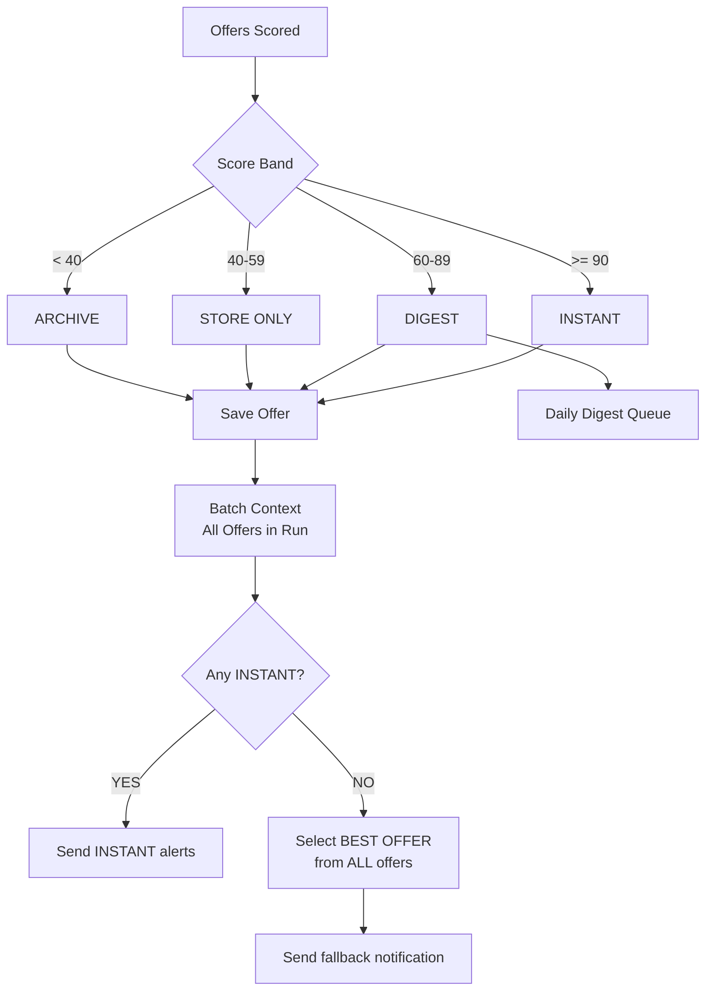

# 🚀 WorkDone – AI Agent Rekrutacyjny (Backend)

WorkDone to backendowy agent rekrutacyjny działający cyklicznie. Zbiera oferty pracy z wielu źródeł, filtruje je regułami i scoringiem semantycznym, a następnie wysyła powiadomienia na Discord.

---

## ✅ Co jest najważniejsze teraz

1. **Multi-Location Policy** – możesz utrzymywać wiele polityk lokalizacji naraz (remote/hybrid/onsite + max dni w biurze).
2. **Dynamiczny panel Discord** – status i konfiguracja „w locie” bez restartu aplikacji.
3. **Fallback „najlepsza oferta po skanie”** – opcjonalny tryb: jeśli po skanie nie było żadnej oferty INSTANT, system może wysłać jedną najlepszą ofertę.
4. **Pending Queue** – oferty `ANALYZED` czekają na decyzję (`Aplikowano` / `Odrzuć`).

---

## 🎮 Sterowanie z Discorda

### Panel
Aby wysłać panel sterowania:

```http
POST /api/admin/test/show-panel
```

### Najważniejsze akcje
- `config|status`
- `config|refresh_cv`
- `config|use_cv_skills`
- `config|run_ingestion`
- `config|best_offer_fallback|true` (włącz fallback najlepszej oferty)
- `config|best_offer_fallback|false` (wyłącz fallback)

---

## ⚙️ Jak działa pipeline ofert

```plain
CV files -> merge -> embedding + parsing (keywords/seniority/location)

Scheduler/manual trigger ->
  Ingestion (zbieranie ze wszystkich źródeł naraz) ->
  Pre-processing (Staging):
    - Must-Have filtering
    - Semantic Scoring (Cosine Similarity)
    - **Zapis wszystkich "Must-Have OK" do bazy (Status: NEW)**
  Selekcja TOP-N:
    - Sortowanie całego batcha po dopasowaniu semantycznym
    - **Deep AI Scoring (tylko dla Top 3 najlepszych - oszczędność tokenów)**
    - AI Cache (pomijanie analizy, jeśli fingerprint już istnieje w DB)
  Klasyfikacja & Notify:
    - INSTANT (wysyłane natychmiast)
    - Daily Digest (AI Blessed + Top 10 Best of Rest)
    - opcjonalnie: best-offer fallback, jeśli w skanie nie było INSTANT
```




```mermaid
flowchart LR

    %% ===== PROFILE =====
    A[CV Files] --> B[Merge Documents]
    B --> C[Parsing + Extraction<br/>keywords / seniority / location]
    C --> D[Embedding]
    D --> E[Profile Vector]

    %% ===== TRIGGER =====
    T[Scheduler / Manual Trigger]

    %% ===== INGESTION =====
    T --> F[Ingestion<br/>Providers × Search Contexts]

    %% ===== PROCESSING =====
    F --> G[Enrich Data]
    G --> H[Deduplication]

    %% ===== MATCHING (FAZA 1) =====
    H --> I[Must-Have Filter]
    I --> J[Semantic Scoring<br/>Cosine Similarity]
    
    %% ===== STAGING =====
    J --> J1[(DB Staging<br/>Status: NEW)]
    
    %% ===== SELEKCJA (FAZA 2) =====
    J1 --> J2[Sort by Score<br/>& Select Top-N]

    %% ===== INTELIGENTNE AI =====
    J2 --> K{Deep AI Analysis?}
    K -- YES --> L1{AI Cache Hit?}
    L1 -- NO --> L2[Multi-Model LLM<br/>Scoring & Reasoning]
    L1 -- YES --> M
    L2 --> M[Final Score]
    K -- NO --> M

    %% ===== CLASSIFICATION =====
    M --> N[Classification<br/>INSTANT / DIGEST / ARCHIVE]

    %% ===== FINALIZACJA =====
    N --> O[(DB Update<br/>Status: ANALYZED)]
    O --> P[Discord Notify]

    %% ===== POWIĄZANIE PROFILU =====
    E -. used for .-> J
```

> Uwaga: fallback „najlepszej oferty” **nie zastępuje** INSTANTów. INSTANTy nadal idą normalnie.

---

## ⏱ Harmonogram

Domyślnie:
- ingestion: co 2 godziny
- digest: raz dziennie

Konfiguracja w `application.yaml` (`workdone.scheduling.*`).

---

## 🛠 Stack technologiczny

- **Backend:** Java 21, Spring Boot 4.x
- **AI/ML:** Spring AI + OpenAI/Gemini/Groq, embeddingi: **Cohere (primary) → OpenAI (fallback)**
- **Storage:** PostgreSQL + pgvector
- **Integracje:** Discord Webhooks + Discord Interactions API

---

## 📂 Struktura

1. **ingestion/** – dostawcy ofert i budowa `SearchContext`
2. **analysis/** – filtrowanie, scoring, klasyfikacja, config runtime
3. **orchestration/** – pipeline end-to-end i harmonogram
4. **interaction/** – endpointy API i obsługa kliknięć Discord
5. **storage/** – zapis ofert + wektory

---

## 🛡️ AI Token Protection & Performance

System został zoptymalizowany pod kątem limitów API (np. Groq/OpenAI):
- **Batch Selection**: AI nie jest odpalane dla każdej oferty. System wybiera tylko 2-3 najlepsze oferty z danego runu.
- **AI Result Cache**: Wyniki analizy AI są zapisywane w bazie danych po `fingerprint`. Raz oceniona oferta nigdy nie zużyje tokenów ponownie.
- **Smart Rate Limiting**: System inteligentnie parsuje odpowiedzi 429 (Rate Limit) i blokuje dany model na dokładnie taki czas, o jaki prosi dostawca (obsługa h/m/s).
- **Staging Area**: Wszystkie oferty spełniające bazowe kryteria (Must-Have) trafiają do bazy przed analizą AI, budując bazę wiedzy.

---

## 🗺 Roadmapa
- [x] Multi-location
- [x] Discord control panel
- [x] Fallback najlepszej oferty po skanie (toggle)
- [ ] Dashboard webowy
- [ ] OCR dla CV obrazkowych
- [ ] Uczenie preferencji na podstawie decyzji użytkownika